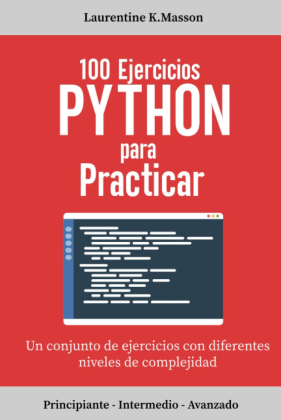

# 100-Ejercicios-Python-
Ejercicos resueltos del libro 100 Ejercicios Python para Practicar de Laurentine K. Masson
Para una mejor practica quiero resolver cada uno de éstos esjercicios a mi manera, luego iré comparando con los realizados en el libro para ir viendo diferentes lógicas.

